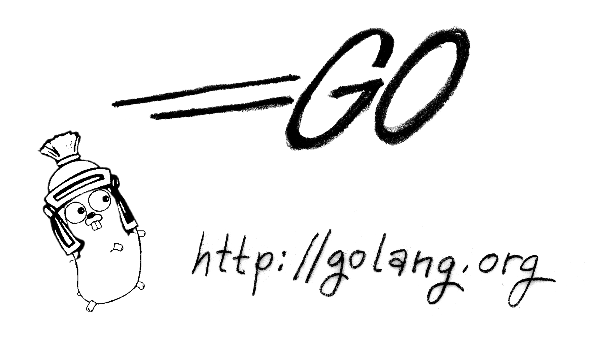

{.title}
# 学习 Go 语言
{.title}
!---

!---

.# 前言
{{preface.md}}

{mainmatter}

# 第一章 简介
{{introduction/epigraph.md}}
{{introduction/index.md}}

## 1. 历史发展
{{introduction/history.md}}

## 2. 语言特性
{{introduction/feature.md}}

## 3. 可用文档
{{introduction/docs.md}}

## 4. 学习方式
{{introduction/howtolearn.md}}

# 第二章 语言基础
{{basics/epigraph.md}}
{{basics/index.md}}

## 1. Hello world
{{basics/helloworld.md}}

{{inc/bib.xml}}
{backmatter}
